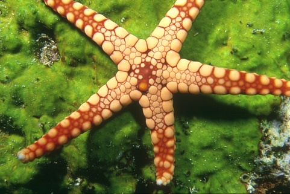

# Mean Shift Parallelization
## Table of Contents

1. [Introduction](#introduction)
2. [Prerequisites](#prerequisites)
3. [Complete Workflow - Example](#complete-workflow---example)
4. [Complete Workflow - Custom](#complete-workflow---custom)
5. [Performance](#performance)

## Introduction

This repository is part of my B.Sc. Thesis, which focuses on the 
**parallelization of the Mean Shift algorithm** for modern high-performance 
computing architectures.  

Mean Shift is a **density-based clustering method** which is particularly attractive for its capability of allowing flexible identification of clusters without extensive manual tuning of parameters. Unlike other clustering methods, it can discover clusters directly from the data without explicitly setting the number of groups or constraining their shapes. This makes it one of the most widely used algorithms for **image segmentation**, where boundaries and groupings can vary greatly depending on the input.

However, this comes at the cost of a **quadratic computational complexity**, which limits its scalability to large datasets and high-resolution images.  

Therefore, leveraging the inherently **independent operations** of Mean Shift, the project explores **four** different **parallel implementations**:  

- **OpenMP** over naive Mean Shift 
- **OpenMP** over matrix-based Mean Shift
- **OpenMP + OpenBLAS** over matrix-based Mean Shift
- **OpenACC** over naive Mean Shift

Additionally, based on the existing integration with **Simple Linear Iterative Clustering (SLIC)** for superpixel generation,
this projects extends the sequential SLIC-Mean Shift approach by providing:

- A fully parallel **SLIC–Mean Shift pipeline** 

where SLIC is parallelized using both **OpenMP** and **OpenACC**.


### Examples
Samples images from BSDS300 dataset, using different bandwidth values:


<table>
  <tr>
    <td align="center"><br>Original</td>
    <td align="center"><br>bw=13</td>
    <td align="center"><br>bw=20</td>
  </tr>
  <tr>
    <td align="center"><br>Original</td>
    <td align="center"><br>bw=9</td>
    <td align="center"><br>bw=15</td>
  </tr>
</table>


## Prerequisites
- C++ compiler compatible with C++11 or higher (GCC, Clang, or MSVC)
- [CMake](https://cmake.org/download/) (version 3.10 or higher), optional but highly recommended
- Python 3.12
  - Create and activate a virtual environment (optional but recommended):
    ```bash
    python -m venv venv
    ```
    - On Windows:
      ```bash
      venv\Scripts\activate
      ```
    - On Linux/macOS:
      ```bash
      source venv/bin/activate
      ```
  - Install the required Python packages using `requirements.txt`:
    ```bash
    pip install -r requirements.txt
    ```

## Complete Workflow - example
The following steps use default example configurations defined in `config.py`.
However, arguments can be configured to customize the execution as shown [below](#complete-workflow---custom).

Note that OpenACC is **not** enabled by default. If you want to use the OpenACC implementation, please see [recommandations](#recommandations).

1. **Clone** the repository:

   ```bash
   git clone https://github.com/martinadep/meanshift_parallelization
   cd meanshift_parallelization
   ```

2. **Convert input image to CSV** format:
   

   ```bash
   python ./py_utils/img_to_csv.py
   ```
  
   This will generate a CSV file that will be processed by the C++ program.

3. **Run the Mean-Shift algorithm**:

      On Windows (MinGW):
     ```bash
     cmake -B build
     cmake --build build
     ./build/mean_shift
     ```

      On Linux/macOS:
     ```bash
     cmake -B build
     cmake --build build
     ./build/mean_shift
     ```

   This will process the CSV file and generate a new output CSV file.

4. **Convert the output CSV** back to an image:

   ```bash
   python ./py_utils/csv_to_img.py
   ```

   This will transform the processed data back into a **segmented image**.


## Complete Workflow - custom
The following steps allows to configure the input image path and enables Mean-Shift bandwidth and kernel selection, as well as using other variants.

Mean Shift: 
- `mean_shift`
- `mean_shift_matrix`
- `mean_shift_matrix_blas`
- `mean_shift_acc`

SLIC - Mean Shift:
- `slic_ms`
- `slic_ms_matrix`
- `slic_ms_matrix_blas`
- `slic_ms_acc`


1. **Clone** the repository:

   ```bash
   git clone https://github.com/martinadep/meanshift_parallelization
   cd meanshift_parallelization
   ```

2. **Convert input image to CSV** format:

   You can specify the input image and output CSV file paths by providing arguments in the command line:

   ```bash
   python ./py_utils/img_to_csv.py -i image.jpg -o output.csv
   ```

   This will generate a CSV file that will be processed by the C++ program.

3. **Run the Mean-Shift algorithm**:

      
      On Windows using MinGW:
     ```bash
     cmake -G "MinGW Makefiles" -B build
     cmake --build build
     ```

      On Linux/macOS:
     ```bash
     cmake -B build
     cmake --build build
     ```

      You can specify the bandwidth, and the input and output CSV file paths, by providing arguments in the command line:
      ```bash
      ./build/mean_shift [--kernel | -k kernel_name] [--bandwidth | -b bandwidth] [--input | -i input_csv] [--output | -o output_csv] [--superpixels | -s num_superpixels]
      ```
   **Example**
   
   Selecting kernel function and bandwidth
   ```bash
   ./build/mean_shift -k gaussian -b 20
   ```
   
   This will process the CSV file and generate a new output CSV file.

4. **Convert the output CSV** back to an image:
   
   You can specify the output image and input CSV file paths by providing arguments in the command line:

   ```bash
   python ./py_utils/img_to_csv.py -i input.csv -o image.jpg
   ```

   This will transform the processed data back into your ***segmented image***.

## Performance

### Mean Shift

Considering 128x85 resized images from BDSD300 dataset:

| Variant | Sequential Version | Parallel Version | Speedup |
|---------|--------------------|------------------|---------|
| mean_shift | 4.08 s       | 0.07 s     | **58.29**    |
| mean_shift_matrix | 4.13 s       | 0.09 s     | **45.89**    |
| mean_shift_matrix_blas | 36.59 s       | 1.56 s     | **23.45**   |
| mean_shift_acc | 4.08 s      | ---      | ---    |

### SLIC - Mean Shift 

Considering 481x321 images from BDSD300 dataset:

| Variant | Sequential Version | Parallel Version | Speedup |
|---------|--------------------|------------------|---------|
| slic_ms | 4.98 s       | 0.74 s     | **6.72**   |
| slic_ms_matrix | 5.43 s       | 0.68 s     | **7.99**    |
| slic_ms_matrix_blas | 5.63 s       | 0.65 s     | **8.66**    |
| slic_ms_acc | 4.98 s       | 0.24 s     | **20.75**    |

## Recommandations
#### Enabling OpenACC (disabled by default)
OpenACC is NOT enabled automatically. You must turn it on at configure time:

```bash
cmake -B build -DENABLE_OPENACC=ON
cmake --build build 
```

#### Kernel
You can choose between three different Kernels: *gaussian*, *uniform* and *epanechnikov*, through the `--kernel | -k` flag via CLI. 
The Gaussian is the most accurate, while the Epanechnikov allows for faster executions.

#### Bandwidth
Recommended bandwidth values for image segmentation are typically **between 10 and 20**. Set it via the CLI with the `--bandwidth | -b` flag. 